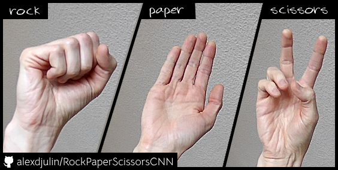

# CNN Systolic-Array Accelerator for Gesture Recognition

This repository contains the algorithm exploration and hardware-aware CNN design used in an Apple-sponsored student ASIC tape-out project.

The work explores small CNN architectures for 64x64 grayscale gesture recognition and maps them to a systolic-array based INT8 CNN accelerator implemented in 65 nm.

Tools:
- PyTorch
- MATLAB
- Verilog (hardware design not fully released)

Note: Some hardware design files are omitted due to course policy.



## Highlights

- End-to-end INT8 TFLite export and evaluation pipeline
- MATLAB implementation covering Conv/ReLU/Pool/Flatten/FC
- Golden comparison against TFLite intermediate tensors, with `dense_i8` reaching `0 diff`

## Repository Layout

- `pytorch/`: training, quantized export, evaluation, and demo resources
- `matlab/`: INT8 operator implementations and alignment scripts
- `models/`: shared model artifacts used by both pipelines

## Quick Start

1. Create and activate a Python environment

```bash
python3 -m venv .venv_tflite
source .venv_tflite/bin/activate
pip install -r pytorch/requirements.txt
```

2. Follow the pipeline-specific guides

- Python pipeline: `pytorch/README.md`
- MATLAB pipeline: `matlab/README.md`

## Repro Commands

Run from repository root:

```bash
.venv_tflite/bin/python pytorch/export_tflite_params_mat.py \
  --model models/v2.int8.tflite \
  --out models/v2.int8.params.mat

.venv_tflite/bin/python matlab/dump_tflite_conv_acts.py \
  --model models/v2.int8.tflite \
  --image matlab/scissors_200_v1_test_1644.png \
  --outdir matlab/debug
```

## Public Release

See `docs/PUBLIC_RELEASE_CHECKLIST.md` before switching the repository to public.
